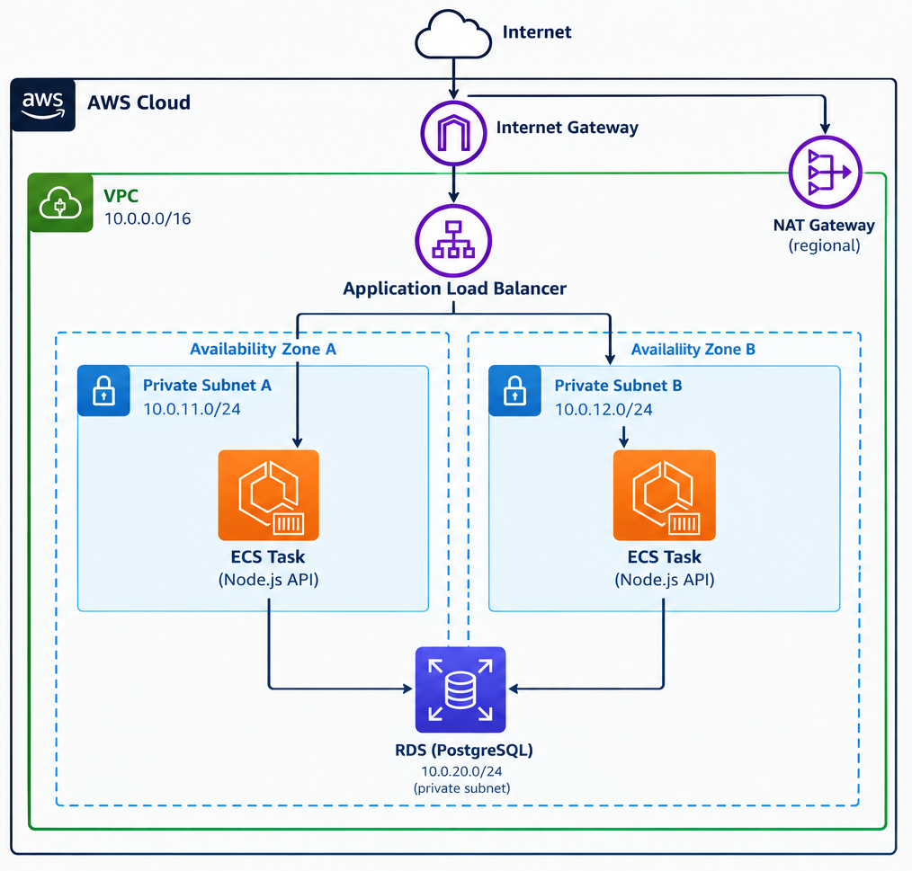

# Node.js API on AWS ECS

## Project summary:

- **API**: Simple REST API built with Node.js and Express to manage
products. It includes APIs to create, read, udpate, and delete products
from the database.
- **Storage**: Data is stored in **PostgreSQL**, which is hosted on **Amazon RDS**.
- **Containers**: Images are stored in AWS ECR (Elastic Container Registry).
- **CI/CD**: The CI/CD workflow is managed by **AWS CodePipeline**. The pipeline is
triggered on pushes to the `main` branch. If tests succeed, the changes are promoted
to the **Development** environment. During a deployment, AWS CodeBuild uses
`buildspec.yml` to build the Docker image, push it to Amazon ECR, and 
deploy the new version to ECS.

## Project Architecture on AWS



- **Application Load Balancer (ALB)**: Receives incoming HTTP/HTTPS traffic and distributes requests across the ECS tasks. The ALB listeners accept traffic on ports 80 and 443, while the associated Target Groups forward requests to port 3000, where the Node.js application is listening.
- **ECS Cluster**: Runs only the application containers, with one Node.js API container in each private subnet, for high availability.
- **Private Subnets**: The ECS tasks run in separate Availability Zones and are not directly accessible from the internet.
- **RDS PostgreSQL**: The database receives traffic from the app instances only.
- **NAT Gateway (Regional)**: Provides outbound internet access for resources in the private subnets without exposing them to the public internet.
- **Internet Gateway**: Provides connectivity between the VPC and the public internet.
- **VPC**: Hosts the entire application infrastructure.

## Technology stack

- Node.js 20 and Express
- PostgreSQL and Amazon RDS
- Knex.js for migrations and database access
- Docker and Amazon ECR
- Amazon ECS
- AWS CodePipeline and CodeBuild

## API endpoints

- `GET /health` — health check
- `GET /api/products` — list products
- `POST /api/products` — create a product
- `GET /api/products/:id` — retrieve a product
- `PUT /api/products/:id` — update a product
- `DELETE /api/products/:id` — delete a product

## Running locally

Create a `.env` file with the required settings:

```env
PORT=3000
PG_HOST=db
PG_PORT=5432
PG_USER=postgres
PG_PASSWORD=postgres
PG_DATABASE=products
PG_SSL=false
```

Then start the API and PostgreSQL database with Docker Compose:

```bash
docker compose up --build
```

The API will be available at `http://localhost:3000`. The container entrypoint
waits for PostgreSQL, runs the Knex migrations and development seed, and then
starts the server.

## Deployment flow

```text
Source repository
      ↓
AWS CodePipeline
      ↓
AWS CodeBuild → Docker image → Amazon ECR
      ↓
Amazon ECS → Node.js API → Amazon RDS for PostgreSQL
```

The ECS task receives the database connection variables and other 
environment variables through its Task Definition. Production
deployments should enable SSL by setting `PG_SSL=true`.
